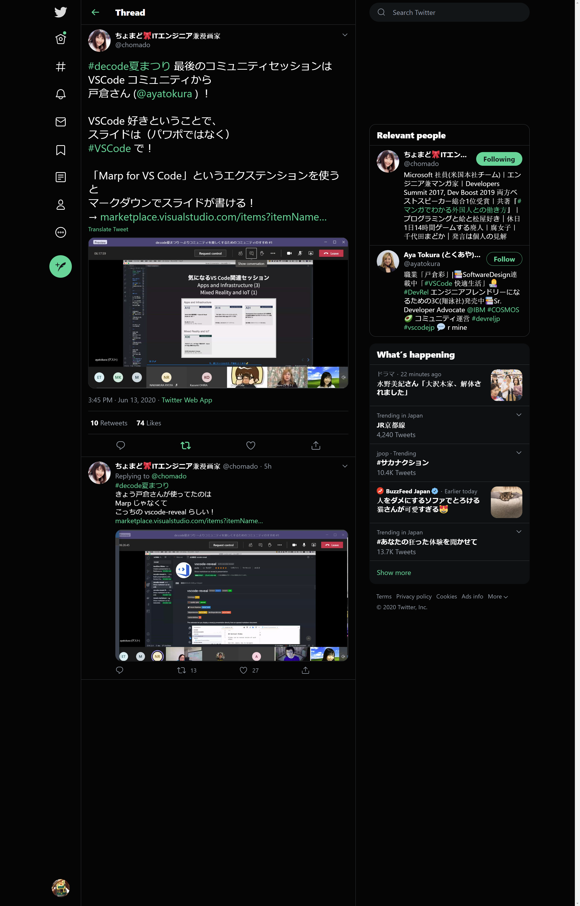

---
theme: "Night"
transition: "none"
enableMenu: false
enableChalkboard: false
enableTitleFooter: false
---

## Hello revealjs, Hello World!!!
#### tulis

A sample slides using [revealjs]

[revealjs]: https://revealjs.com/

---

## VSCODE revealjs

A revealjs Visual Studio Code is available at:
https://github.com/evilz/vscode-reveal

---

## First Encountered

<!--  -->


https://twitter.com/chomado/status/1271679998139617280?s=20


---

## Sample Hello revealjs code in C# code

```
using System;

namespace HelloRevealJs
{
    public class HelloRevealJs
    {
        Console.WriteLine("Hello revealjs");
    }
}
```

---

## References

* How to write slides?
    * https://revealjs.com/markdown/
* Marp VS Code Repository
    * https://github.com/evilz/vscode-reveal
* Official Sample Slides by Marp
    * https://github.com/yhatt/marp-cli-example